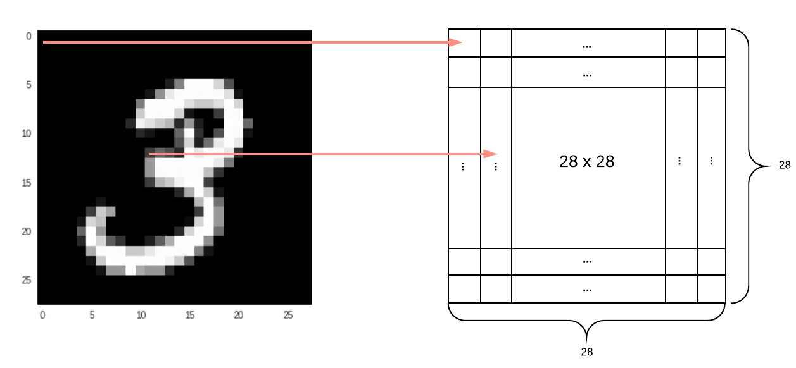
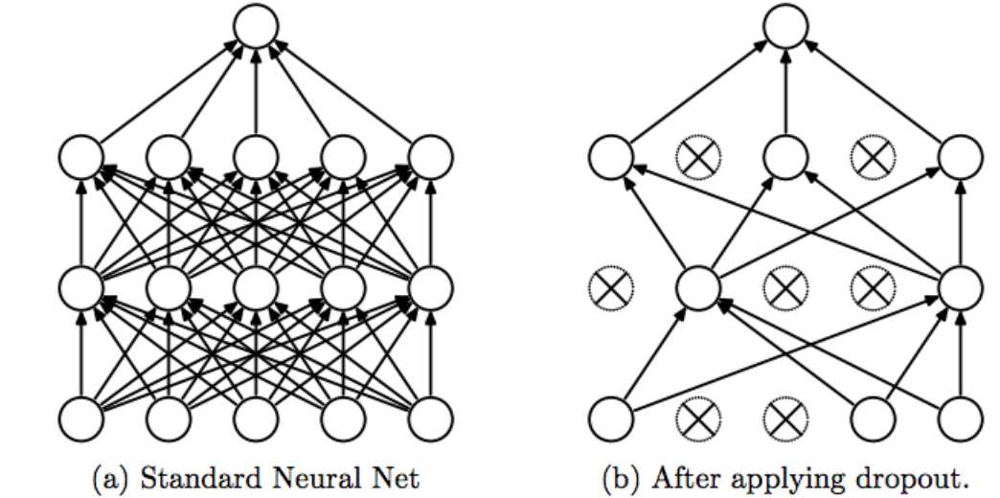

# Seminar 4: Convolutional Neural Networks (CNN)

The goal of this seminar exercise is to learn how to create and train a convolutional neural network in TensorFlow. 

We will demonstrate how to create a CNN to perform multi-class classification and how the classification accuracy can be improved by using methods such as dropout.

We consider the task of image classification for handwritten digit recognition, based on the [MNIST](https://en.wikipedia.org/wiki/MNIST_database) dataset. 

## Image data

Before exploring how to perform multi-class image classification, let's have a look on how images are represented.

### Black & White images

As an example for black and white images (obtained from MNIST dataset):



This image has a resolution of 28x28 and 1 channel. Each pixel is a number between 0 and 1, where 0 is shown as black, 1 is white and any number inbetween is gray.  The image data is presented as a flattened long vector with a length of 784 (28x28).  

### Colour images


In this beautiful cat photo, one pixel has 3 dimensions (i.e. the RGB channels). The shape of this image is 178x218x3. Each element in one pixel is a number between 0 and 255.  

## MNIST dataset

MNIST stands for the *Modified National Institute of Standards and Technology* and is a [dataset](http://yann.lecun.com/exdb/mnist/) of 60,000 small square 28×28 pixel grayscale images of handwritten single digits between 0 and 9.


### Import the dataset

TensorFlow has the dataset already built in, so there is no need to manually download it. 

We can simply use a built-in function *load_data()* to get this dataset split into training and testing samples.

```
# load data 
mnist = tf.keras.datasets.mnist
(x_train, y_train), (x_test, y_test) = mnist.load_data()
```

### Preprocessing the data

```
# scale data
x_train = x_train.astype('float32') / 255.0
x_test = x_test.astype('float32') / 255.0
```

### Checking the data format

```
# shapes of training set
print("Training set images shape: {shape}".format(shape=x_train.shape))
print("Training set labels shape: {shape}".format(shape=y_train.shape))
# shapes of test set
print("Test set images shape: {shape}".format(shape=x_test.shape))
print("Test set labels shape: {shape}".format(shape=y_test.shape))
```


### Visualize sample images

If we want to visualize 8 by 8 images randomly chosen from the training set, we pass arguments `training_set`, `row=8`, and `col=8` to the function below.

```
# Visualize 8*8 images
def display(x, row, col):
    num_of_images = row * col
    fig, axe = plt.subplots(row, col, figsize=(8, 8))

    for i in range(row):
        for j in range(col):
            axe[i][j].imshow(x[np.random.randint(0, num_of_images), :].reshape(28, 28), origin="upper", cmap="gray",
                             interpolation="nearest")
            axe[i][j].set_xticks([])
            axe[i][j].set_yticks([])
    plt.show()
    
row = 8
col = 8
display(x_train, row, col)
```
## MNIST classification using CNN

###  Basic architecture


A CNN can have a combination of different layers, which one implementing a specific task:

#### Convolutional layer (Conv2D)

The convolution layer is used as a feature extractor by applying a [convolutional operation](https://en.wikipedia.org/wiki/Convolution) over the input (image) data. A sliding filter is applied over a part of the image (the receptive fields) with the same size of the filter and the dot product between the filter and the receptive fields is calculated. Then, we slide the filter over the next receptive fields part using a *stride* value and repeat the process. The output of this convolutional layer will be the input of the next layer. We can also use a `ReLU activation function` to ensure all negative values will be represented as zero.


In TensorFlow, the [tf.keras.layers.conv2d](https://www.tensorflow.org/api_docs/python/tf/keras/layers/Conv2D) creates a convolution kernel that is convolved with the layer input to produce a tensor of outputs. It takes inputs of shape `[batch_size, rows (or height), cols (or width), channels]`. For the MNIST dataset, we use an input shape of 28x28x1.

```
tf.keras.layers.Conv2D(
    filters, kernel_size, strides=(1, 1), padding='valid',
    data_format=None, dilation_rate=(1, 1), groups=1, activation=None,
    use_bias=True, kernel_initializer='glorot_uniform',
    bias_initializer='zeros', kernel_regularizer=None,
    bias_regularizer=None, activity_regularizer=None, kernel_constraint=None,
    bias_constraint=None, **kwargs
)
```

`filters` is the number of filters to use, which is also the dimensionality of outputs. `kernel_size` specifies the `[height, width]` of the filter. The `stride` argument is set to be `(1, 1)` by default. The `padding` argument takes one of the values: `valid` or `same`. `same` preserves the shape of input tensor by adding 0 values to the edges and `valid` may drop the columns on the right or rows at the bottom. The `activation` parameter refers to the activation function to be used, as specified [here](https://www.tensorflow.org/api_docs/python/tf/keras/activations).

**Example:**
```
tf.keras.layers.Conv2D(32, 5, activation='relu', padding="same", input_shape=(28, 28, 1))
```

#### Max pooling layer

The pooling layer is also used for feature extraction. The idea is to keep only the most relevant features from a given image, so reducing its dimensionality.

Pooling layers apply a similar process of the convolutional layers: a sliding matrix is consecutively applied over the image and the max value (for Max Pooling) or the average value (for Average Pooling) is taked.


In TensorFlow, the [max pooling](https://www.tensorflow.org/api_docs/python/tf/keras/layers/MaxPool2D) layer is used for downsampling the input representation by taking the maximum value over the window defined by *pool_size* for each dimension along the features axis. The window is shifted by *strides* in each dimension. 

```
tf.keras.layers.MaxPool2D(pool_size=(2, 2), strides=None, padding='valid', data_format=None, **kwargs)
```

**Example:**
```
tf.keras.layers.MaxPooling2D(pool_size=[2, 2], strides=2)
```

#### Dropout layer

The dropout layer is used for randomly setting input units to 0 with a given frequency (*rate*) at each step during training time, which helps prevent overfitting.



In TensorFlow, the [](https://www.tensorflow.org/api_docs/python/tf/keras/layers/Dropout) has the following format and arguments:

```
tf.keras.layers.Dropout(rate, noise_shape=None, seed=None, **kwargs)
```

The `rate` argument takes a value between 0 and 1. `rate=0.2` would drop out 20% of the input units. 

The `training` argument takes a boolean. `training=True` will apply dropout while `training=False` returns the input untouched. 

**Example:**
```
tf.keras.layers.Dropout(0.3)
```

#### Flatten layer

The flatten layer is used to convert an input tensor from a matrix format to a single feature vector. This feature vector can then be passed to a dense layer for final classification.


In TensorFlow, we can use [tf.keras.layers.Flatten](https://www.tensorflow.org/api_docs/python/tf/keras/layers/Flatten):

```
tf.keras.layers.Flatten(data_format=None, **kwargs)
```

#### Dense layer

The dense layer is a densely-connected neural network layer implementing the operation: *output = activation(dot(input, kernel) + bias)*, where *activation* is the element-wise activation function passed as the activation argument, *kernel* is a weights matrix created by the layer, and *bias* is a bias vector created by the layer. It is then used to perform classification. 


In TensorFlow, dense layers are defined as [tf.keras.layers.Dense](https://www.tensorflow.org/api_docs/python/tf/keras/layers/Dense).

```
tf.keras.layers.Dense(
    units, activation=None, use_bias=True,
    kernel_initializer='glorot_uniform',
    bias_initializer='zeros', kernel_regularizer=None,
    bias_regularizer=None, activity_regularizer=None, kernel_constraint=None,
    bias_constraint=None, **kwargs
)
```

The main parameters are: `units`, which is an integer representing the dimensionality of the output space, the activation function to be used (`relu`, `softmax` or any other), `use_bias`, to indicate whether the layer uses a bias vector, and the `kernel_initializer` for the kernel weights matrix.

**Example:**
```
tf.keras.layers.Dense(1024, activation='relu'),
```

Let's put this CNN together. 

```
# CNN model
classification_cnn = tf.keras.Sequential([
    tf.keras.layers.Conv2D(32, 5, activation='relu', padding="same", input_shape=(28, 28, 1)),
    tf.keras.layers.MaxPooling2D(pool_size=[2, 2], strides=2),
    tf.keras.layers.Dropout(0.3),
    tf.keras.layers.Conv2D(64, 5, activation='relu', padding="same", input_shape=(28, 28, 1)),
    tf.keras.layers.MaxPooling2D(pool_size=[2, 2], strides=2),
    tf.keras.layers.Dropout(0.3),
    tf.keras.layers.Flatten(),
    tf.keras.layers.Dense(1024, activation='relu'),
    tf.keras.layers.Dropout(0.4),
    tf.keras.layers.Dense(10, activation='softmax')
])
```

You can also have a summary of your model, which allows you to check the input and the output shape of each layers and the number of parameters your CNN is able to train.


###  Generating and training the model

After defining the structure of your model, you can [compile](https://www.tensorflow.org/guide/keras/train_and_evaluate) and then *train* your model.

```
# model compilation
classification_cnn.compile(loss=tf.keras.losses.sparse_categorical_crossentropy, optimizer=tf.keras.optimizers.Adam(), metrics=['accuracy'])
```

#### Notes on optimizers

Refer to [tf.keras.optimizers.Optimizer](https://www.tensorflow.org/api_docs/python/tf/keras/optimizers/Optimizer) and [Week03's material](../../Week03/Class/Seminar3.md). Remember to set all the necessary parameters for the optimizer you choose (e.g. learning rate and/or momentum). 

#### Training

For training your model, you can specify some hyper-parameters (as discussed in the previous seminars), such as number of epochs for training, sample (batch) size and also the *validation_split* parameter, which refers to the part of training data that will be used for validation (see [documentation](https://www.tensorflow.org/guide/keras/train_and_evaluate)).

```
history = classification_cnn.fit(np.expand_dims(x_train, -1), y_train, batch_size=128, epochs=15, validation_split=0.3, verbose=1)
```

The [history](https://www.tensorflow.org/api_docs/python/tf/keras/callbacks/History) object is returned for every model trained in TensorFlow. It holds a record of the loss values and metric values during training, and can be used for model evaluation (including plotting).

#### Softmax activation for classification

The softmax function is a generalization of the logistic function, defined as:

, for j = 1, ..., K.

The output of the softmax function can be seen as a probability distribution over K possible outcomes.  

There are two different versions of softmax cross-entropy loss function available in TensorFlow:

* [tf.nn.softmax_cross_entropy_with_logits](https://www.tensorflow.org/api_docs/python/tf/nn/softmax_cross_entropy_with_logits)
* [tf.nn.sparse_softmax_cross_entropy_with_logits](https://www.tensorflow.org/api_docs/python/tf/nn/sparse_softmax_cross_entropy_with_logits)

The main difference is in the `labels` argument. For `tf.nn.softmax`, the argument takes inputs of shape `[batch_size, num_classes]`, i.e., each row should be a one-hot vector. In the sparse version, the `labels` argument takes a vector of indices in (0, num_classes).

###  Testing and evaluating the model

The final part of our CNN classification example is to test our model over new data. 

For this, we can use the method `evaluate()`, as shown below:

```
# model evaluation
loss, accuracy = classification_cnn.evaluate(np.expand_dims(x_test, -1), y_test, verbose=0)
```

Once your model is fully trained and tested (and you are happy with it!), you can use it for prediction. 

Have a look at the [documentation](https://www.tensorflow.org/guide/keras/train_and_evaluate) for the entire process of designing, training and testing models in TensorFlow.

### Example notebooks

* [Week4.ipynb](./week4.ipynb)
* [CNN - MNIST classification in Keras #1](./Ex_CNN_TFKeras.ipynb)
* [CNN - MNIST classification in Keras #2](./Ex_CNN_MNIST_2.ipynb)
* [Baseline_CNN_MNIST - using K-fold](./Baseline_CNN_MNIST)
* [CNN for the Fashion MNIST dataset](https://machinelearningmastery.com/how-to-develop-a-cnn-from-scratch-for-fashion-mnist-clothing-classification/)

## References

* **MUST SEE**: [TensorFlow, Keras and deep learning, without a PhD](https://codelabs.developers.google.com/codelabs/cloud-tensorflow-mnist/#0).
* **MUST SEE**: [ConvNetJS MNIST demo](https://cs.stanford.edu/people/karpathy/convnetjs/demo/mnist.html).
* [TensorFlow 2 Tutorial: Get Started in Deep Learning With tf.keras](https://machinelearningmastery.com/tensorflow-tutorial-deep-learning-with-tf-keras/).
* [How to Develop a CNN for MNIST Handwritten Digit Classification](https://machinelearningmastery.com/how-to-develop-a-convolutional-neural-network-from-scratch-for-mnist-handwritten-digit-classification/).

## Homework

Run all the examples from this seminar. You should familiarize with the entire structure of the notebooks (data acquisition and preparation, model specification, model training, model evaluation and interpretation of results). You may also play with the setting of various hyper-parameters to observe the effect on the classification accuracy.

This will be a good practice in general, but also useful for Assignment 1 of the continuous assessment part of the module.
